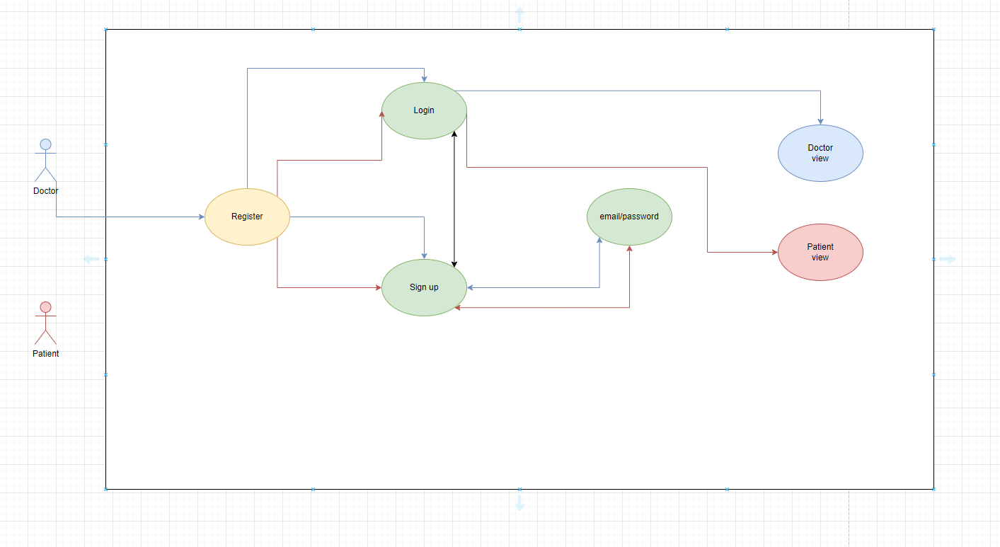
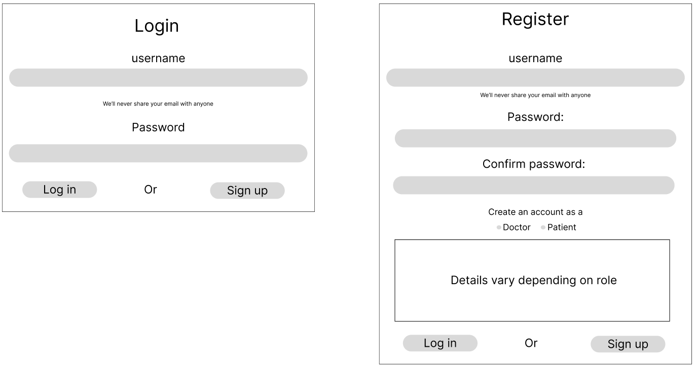
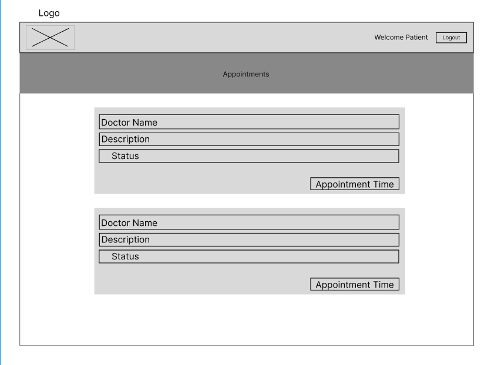

## Installation and Setup

To run the AppointMate web application locally, you will need to have the following software installed on your machine:

- Node.js (v14.16.0 or later)

- MongoDB (v4.4.5 or later)

Once you have installed the required software, follow these steps:

1. Clone the repository to your local machine:

`git clone https://github.com/Byron-web/appointmate`

2. Navigate to the project directory:

`cd appointmate`

3. Install the dependencies:

`npm install`

4. Create a `.env` file in the root directory of the project and set the following environment variables:

`PORT=3000

MONGODB_URI=mongodb://localhost:27017/appointmate

Or use the Altas URI already configured within the app.

5. Start the application:

`npm start`

6. Open a web browser and navigate to `http://localhost:3000` to access the application.

## Deployment

To deploy the AppointMate web application to a cloud hosting provider such as AWS, Heroku, or Vercel, follow the provider's documentation on deploying a Node.js application. Set the `MONGODB_URI` and `JWT_SECRET` environment variables as appropriate for your deployment environment.

## Usage

Once the AppointMate web application is up and running, doctors and patients can log in using one of three methods: Facebook, Google, or username and password. Upon successful login, a JWT (JSON Web Token) will be generated and stored in local storage. Doctors can create, edit, and delete appointments, as well as view patient information. Patients can view their upcoming appointments.

For Doctor:

1.  Log in to the app using your account credentials.
2.  After logging in, you will see the dashboard. Here, you can see a list of your appointments.
3.  To create a new appointment, click on the "Create Appointment" button. Select the patient's name from the drop-down list (which is populated with all the patients who have signed up), enter the reason for the appointment in the text box, select the status from the drop-down list, and finally select the date and time of the appointment.
4.  Click "Save" to create the appointment.
5.  To edit an appointment, click on the appointment from the list of appointments on the dashboard. Edit the necessary details and click "Save" to update the appointment.
6.  To delete an appointment, click on the appointment from the list of appointments on the dashboard. Click the "Delete" button to remove the appointment.

For Patient:

1.  Log in to the app using your account credentials.
2.  After logging in, you will see the dashboard. Here, you can see a list of your appointments.
3.  To view your appointment details, click on the appointment from the list of appointments on the dashboard.
4.  Please note that as a patient, you cannot edit, book, or delete appointments.

## Testing

The AppointMate web application should be thoroughly tested before deployment to ensure that it meets the functional and non-functional requirements outlined in this documentation. Automated unit and integration tests should be written using a testing framework such as Jest or Mocha, and manual end-to-end testing should be performed by a dedicated QA team or individual. Testing should cover all user stories and edge cases.

To run the automated tests, run the following command:

`npm test`

## Conclusion

This readme file provides information on how to install, deploy, and use the AppointMate web application, as well as how to test it. By following the steps outlined in this document, you should be able to run the application locally, deploy it to a cloud hosting provider, and use it to manage appointments for doctors and patients. Remember to test the application thoroughly before deployment to ensure that it meets the functional and non-functional requirements outlined in this documentation.

## Security Measures

- Used JWT for authentication
- Created a custom route policy that only allows access to certain data and views according to the users "role"
- The JWT token provided expires within an hour
- The MongoDB URI is safely stored in a .env file
- A user needs to be logged in to view any of the app's data or sensitive views
- Not linked to any third party APIs or third party libraries

## Libraries

### React App (Frontend)

- Jose: A JavaScript Object Signing and Encryption (JOSE) library that supports JSON Web Tokens (JWT) and JSON Object Signing and Encryption (JOSE) standards.
- Lodash: A JavaScript utility library that provides functions for common programming tasks such as iterating arrays, manipulating objects, and working with strings.
- React-Datepicker: A simple and reusable datepicker component for React.
- @testing-library/jest-dom: A testing utility library that provides custom Jest matchers for DOM elements.
- React-Test-Renderer: A testing utility library for rendering React components to a JSON format.
- Text-Encoding: A JavaScript polyfill for the Encoding Living Standard APIs.

### Node.js/Express App (Backend)

- Body-Parser: A middleware for parsing incoming request bodies in a middleware before your handlers, available under the req.body property.
- Cors: A middleware that enables CORS with various options.
- Jsonwebtoken: A library that allows you to generate and verify JSON Web Tokens.
- Mongoose: An Object Data Modeling (ODM) library for MongoDB and Node.js.
- Nodemon: A tool that helps develop Node.js based applications by automatically restarting the node application when file changes in the directory are detected.
- Swagger-jsdoc: A library that allows you to write Swagger specification using JSDoc syntax.
- Swagger-ui-express: A middleware for express to serve the Swagger UI bound to your Swagger specification.
- UUID: A library for generating universally unique identifiers (UUIDs).
- Moment: A lightweight JavaScript date library for parsing, validating, manipulating, and formatting dates.

# AppointMate Software Requirements Documentation

## System Architecture

The AppointMate web application will be built using a MERN (MongoDB, Express.js, React.js, Node.js) stack. MongoDB, a NoSQL database, will be used to store data about patients and appointments. The server will be built using Express.js, and it will provide a RESTful API for the frontend to interact with. The frontend will be built using React.js with CRA, and it will be styled using react-bootstrap.

Authentication will be handled using Helmut and custom middleware. There will be two types of users in the system: doctors and patients. Patients can view their appointments, whereas doctors can create, edit, and delete appointments, as well as view patient information.

Doctors and patients can log in using one of three methods: Facebook, Google, or username and password. Upon successful login, a JWT (JSON Web Token) will be generated and stored in local storage.

## System Requirements Specification

### User Stories

- As a doctor, I want to be able to create new appointments for my patients, so that I can manage my schedule.

- As a doctor, I want to be able to edit existing appointments, so that I can make changes to my schedule.

- As a doctor, I want to be able to delete appointments, so that I can cancel appointments that I no longer need.

- As a doctor, I want to be able to view a list of all my appointments, so that I can see my schedule at a glance.

- As a patient, I want to be able to view my upcoming appointments, so that I can plan accordingly.

- As a patient, I want to be able to log in using my Facebook or Google account, so that I don't have to remember another username and password.

- As a patient, I want to be able to register for an account using my email address, so that I can use the app.

- As a patient, I want to be able to log in using my email address and password, so that I can access my appointments.

### Similar Software

There are several similar apps on the market, such as Zocdoc, Doximity, and MyChart. However, AppointMate offers several unique features that set it apart from the competition. First, AppointMate allows doctors to create, edit, and delete appointments, whereas some other apps only allow patients to schedule appointments. Second, AppointMate offers three login options: Facebook, Google, and email/password, whereas some other apps only offer one or two options. Finally, AppointMate is designed to be simple and easy to use, with a clean and intuitive user interface.

### Functional Requirements

1. Users can register for an account using their email address or log in using their Facebook or Google account.

2. Doctors can create new appointments and assign them to patients.

3. Doctors can edit existing appointments, including the patient assigned to the appointment, and the appointment date and time.

4. Doctors can delete appointments that are no longer needed.

5. Patients can view their upcoming appointments.

6. Patients can log in using their email address and password.

7. Users can log out of their account.

8. The app should be secure, with user authentication and authorization implemented using JWTs.

9. The app should be deployed to a cloud hosting provider such as AWS, Heroku, or Vercel.

### Non-Functional Requirements

1. The app should load quickly on a fast internet connection.

2. The app should be reliable and available 24/7, with a service level agreement (SLA) of 99.9% uptime.

3. The app should be scalable, able to handle increased traffic as the user base grows.

4. The app should be maintainable, with clean and modular code and thorough documentation.

5. The app should be tested thoroughly, with automated unit and integration tests as well as manual end-to-end testing.

# Constraints

- The app must comply with relevant data privacy regulations, such as GDPR and HIPAA.

- The app must be hosted on a secure server and use encryption to protect sensitive data.

- The app must be designed with scalability in mind to handle potential increases in user traffic.

# Assumptions

- Users have access to a modern web browser and a reliable internet connection.

- Users have basic computer literacy skills.

- Users are comfortable sharing their personal and medical information with the app.

# Conclusion

This software requirements documentation outlines the system architecture, user stories, functional and non-functional requirements, constraints, and assumptions for the AppointMate web application. The app will be built using the MERN stack and will offer unique features such as doctor-managed appointments and multiple login options. The app will prioritize security, accessibility, reliability, scalability, maintainability, and testing. The app must comply with relevant data privacy regulations and be hosted on a secure server. Users must have access to a modern web browser and a reliable internet connection and must be comfortable sharing their personal and medical information with the app.
